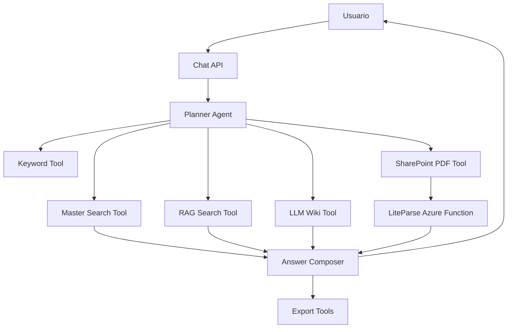

# Arquitectura

## Objetivo

Construir un chat operativo para usuarios de negocio que entienda preguntas, las descomponga y use herramientas especializadas:

1. Buscar palabras clave y filtros en la Planilla Master.
2. Consultar RAG documental.
3. Profundizar con LLM Wiki.
4. Navegar SharePoint por codigo de oferta/proyecto.
5. Leer PDFs completos de propuestas relevantes.
6. Entregar respuesta trazable con tablas y exportables.

## Flujo de agente

## Contrato de datos

La clave primaria funcional es `codigo`, normalmente `O-XXXX` para ofertas o `SH-XXXX` para proyectos. La Master entrega datos estructurados; SharePoint entrega documentos; RAG y Wiki entregan contexto semantico.

## Componentes

- `AgentOrchestrator`: decide pasos, ejecuta herramientas y compone la respuesta.
- `MasterRepository`: carga Excel/SQLite y busca por codigo, cliente, titulo y keywords.
- `SharePointClient`: resuelve carpetas y PDFs usando Microsoft Graph.
- `RagClient`: llama al indice RAG o a la Azure Function LiteParse.
- `WikiClient`: busca contexto en LLM Wiki.
- `ExportService`: genera XLSX, DOCX y PDF desde respuestas.

## Pendientes de integracion real

- Completar variables Graph: `TENANT_ID`, `CLIENT_ID`, `CLIENT_SECRET`, `SHAREPOINT_SITE`.
- Definir endpoint real de LiteParse: `LITEPARSE_FUNCTION_URL`.
- Definir endpoint RAG/indice: `RAG_ENDPOINT` o Azure AI Search.
- Definir fuente de LLM Wiki: endpoint, archivos o repositorio documental.

